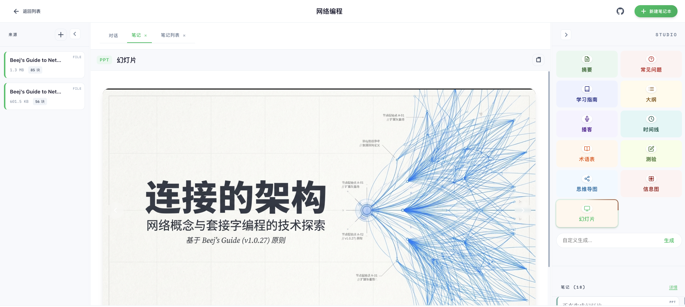

# Notex

<div align="center">

**A privacy-first, open-source alternative to NotebookLM**

[](https://go.dev/)
[](./LICENSE)

Upload documents, organize them into notebooks, and chat with your knowledge base using local or cloud LLMs.



</div>

## What Notex Does

Notex is an AI-powered notebook application for turning your documents into searchable, interactive knowledge bases.

It supports:

- Document uploads for PDFs, text, Markdown, DOCX, and HTML
- Notebook-based organization
- Chat over your uploaded content
- Generated outputs such as summaries, FAQs, study guides, outlines, timelines, glossaries, quizzes, mind maps, infographics, and podcast scripts
- Multiple model backends including OpenAI-compatible APIs and Ollama
- Local-first storage with SQLite by default

## Tech Stack

- Go backend
- Gin HTTP server
- SQLite for default storage and vector metadata
- Plain HTML/CSS/JS frontend
- OpenAI-compatible and Ollama-based model support

## Project Structure

```text
.
|-- backend/                # Server, auth, storage, vector, and provider logic
|-- backend/frontend/       # Static frontend assets
|-- data/                   # Local runtime data (generated at runtime)
|-- docs/                   # Screenshots and project docs
|-- logs/                   # Local log files
|-- main.go                 # CLI entrypoint
|-- go.mod
`-- .env.example
```

## Quick Start

### Prerequisites

- Go 1.25 or newer
- One of:
  - an OpenAI-compatible API key
  - Ollama running locally

### 1. Install dependencies

```bash
go mod tidy
```

### 2. Create your local config

```powershell
Copy-Item .env.example .env
```

### 3. Configure a provider

For OpenAI-compatible APIs:

```env
OPENAI_API_KEY=sk-your-key
OPENAI_BASE_URL=https://api.openai.com/v1
OPENAI_MODEL=gpt-4o-mini
EMBEDDING_MODEL=text-embedding-3-small
```

For Ollama:

```env
OLLAMA_BASE_URL=http://localhost:11434
OLLAMA_MODEL=llama3.2
```

### 4. Run the app

```bash
go run . -server
```

Open [http://localhost:8080](http://localhost:8080).

## CLI Usage

Start the web server:

```bash
go run . -server
```

Ingest a file into a notebook:

```bash
go run . -ingest ./document.pdf -notebook "My Notes"
```

Show the version:

```bash
go run . -version
```

## Configuration

The app loads `.env` and `.env.local` automatically if present.

Common settings:

```env
SERVER_HOST=0.0.0.0
SERVER_PORT=8080

VECTOR_STORE_TYPE=sqlite
SQLITE_PATH=./data/vector.db

STORE_TYPE=sqlite
STORE_PATH=./data/checkpoints.db

MAX_SOURCES=5
CHUNK_SIZE=1000
CHUNK_OVERLAP=200
ENABLE_MARKITDOWN=true
```

Optional integrations supported by the codebase include:

- Google API settings
- GitHub OAuth
- Google OAuth
- Image generation providers
- LangSmith tracing

See [`.env.example`](./.env.example) for the full list.

## Development

Run tests:

```bash
go test ./...
```

Format code:

```bash
gofmt -w .
```

Vet the code:

```bash
go vet ./...
```

## Notes for GitHub

This repository is designed to keep local runtime state out of version control. The included `.gitignore` excludes:

- local environment files
- uploaded documents
- generated databases
- logs
- coverage reports
- local editor and OS artifacts

## License

Apache 2.0. See [LICENSE](./LICENSE).
